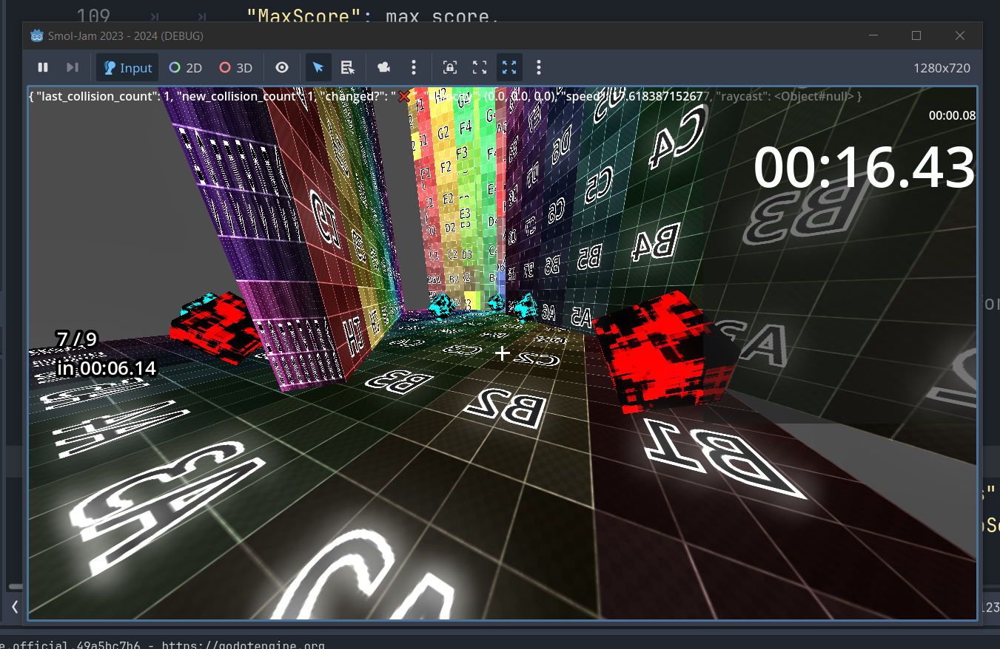
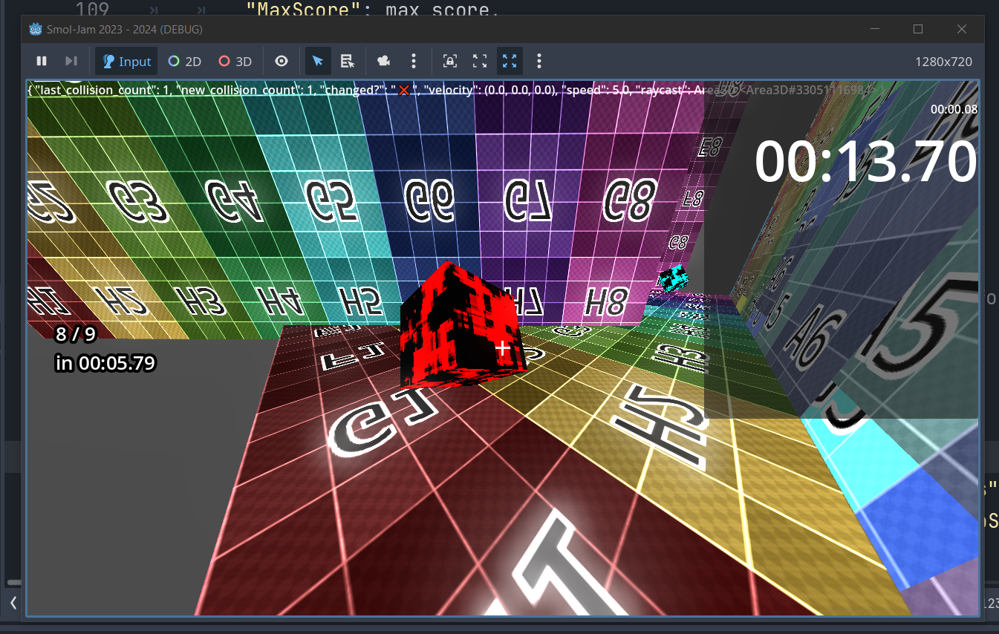

i am tired bruh


anyways

game's prototype is basically done

there are a couple core designs

1. ```gdscript
   func save(save_data : Dictionary):
   	save_data["Player"] = {
   		"Velocity": velocity,
   		"Speed": SPEED,
   		"Position": position,
   		"CameraRotation":camera_rotation,
   		"MaxScore": max_score,
   		"CurrentScore": current_score,
   		"CurrentScoreSeconds": current_score_seconds,
   		"CurrentScoreSubSeconds": current_score_sub_seconds
   	}
   	pass
   ```

The save funcions

this is how all objects should be handled


**NO DELETING OR FREEING OBJECTS, KEEP MEMORY ALIVE!!!**


and you obvi cna't have a save function without it's lover,

2. ```gdscript
   func lOdE(load_data : Dictionary):
   	if "Player" in load_data:
   		#velocity = load_data["Player"]["Velocity"] # wait i literally forgot this being not loaded is literally core to the gameplay
   		
   		position = load_data["Player"]["Position"]
   		camera_rotation = load_data["Player"]["CameraRotation"]
   		max_score = load_data["Player"]["MaxScore"]
   		current_score = load_data["Player"]["CurrentScore"]
   		current_score_seconds = load_data["Player"]["CurrentScoreSeconds"]
   		current_score_sub_seconds = load_data["Player"]["CurrentScoreSubSeconds"]
   		apply_camera_rotation()
   		update_score_display()
   ```

the lOdE funcion

`load()` was taken...

i'll make a better name probably tonight but i'm so tired rn and i just wanted a name

`save_state()` and `load_state()` probably the new names at some pont


anyways

point is

every relavent object has a `save()` and `load()` that just reads in state information and applies it as such, and in a way that's immediate, such as the cubes:

```gdscript
func lOdE(load_data : Dictionary):
	var id = get_instance_id()
	var id_name = "HitCube%s"%id
	if id_name in load_data:
		time_left = load_data[id_name]["TimeLeft"]
		if load_data[id_name]["WasHit"]: state = HitCubeState.HIT
		else: state = HitCubeState.IDLE
		update_cube_state()
```

for basically everything, there's some functions used to set up the variables to do the things, which are called after each time they should update


such as the cube once again the return from 1 linebreak above:

```gdscript
func update_cube_state():
	if not state == HitCubeState.HIT:
		state = HitCubeState.EXPIRED if time_left <= 0.0 else HitCubeState.IDLE
	var color = Color.RED
	match state:
		HitCubeState.IDLE: color = Color.GREEN
		HitCubeState.EXPIRED: color = Color.RED
		HitCubeState.HIT: color = Color.CYAN
	$Area3D/CSGBox3D.material.set_shader_parameter("color",color)

```

there are similar funcions in the player for doing the same sort of thing: actually applying the loaded state

the function names are actually real for that so i'm not adding them here


anyways

the gameplay loop appears to be good so far

it's really fun

see if u can get all 9/9 cubes, i think it's possible but i haven't done it yet and i am SUPER tired rn

i think that's it

i'll wait for you to get out of work and idk for the next 15 minutes
